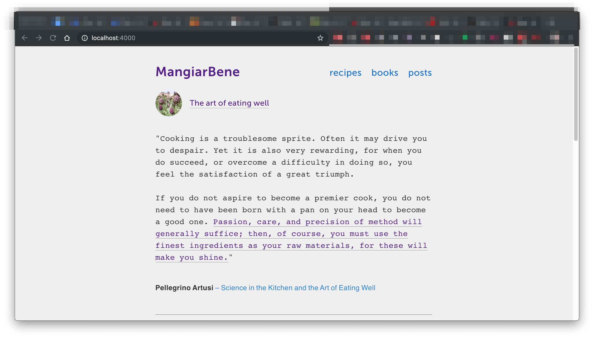

# Jekyll/React API endpoint demo


[Pieter Roozen](https://roozen.nl)

## Jekyll version

With Jekyll it is easily possible to create API endpoints, so blog and collections can be consumed in other website generators.

This **Jekyll** website [MangiarBene/Jekyll](https://trim-seahorse.cloudvent.net/) also provides the same data as API endpoint and is consumed by the equivalent **React** website [Mangiarbene/React](https://api.roozen.nl).

## Local development

### Prerequisites

* You must have [Ruby](https://www.ruby-lang.org/en/documentation/installation/) installed on your machine

### Steps

To set up this website for local development, [clone the repo](https://github.com/Robbie-Cook/mangiarbene-jekyll/archive/master.zip), and run these commands from the root directory.

```bash
gem install bundler
bundle install
bundle exec jekyll serve
```

Your site will then get served on [localhost:4000](localhost:4000).

